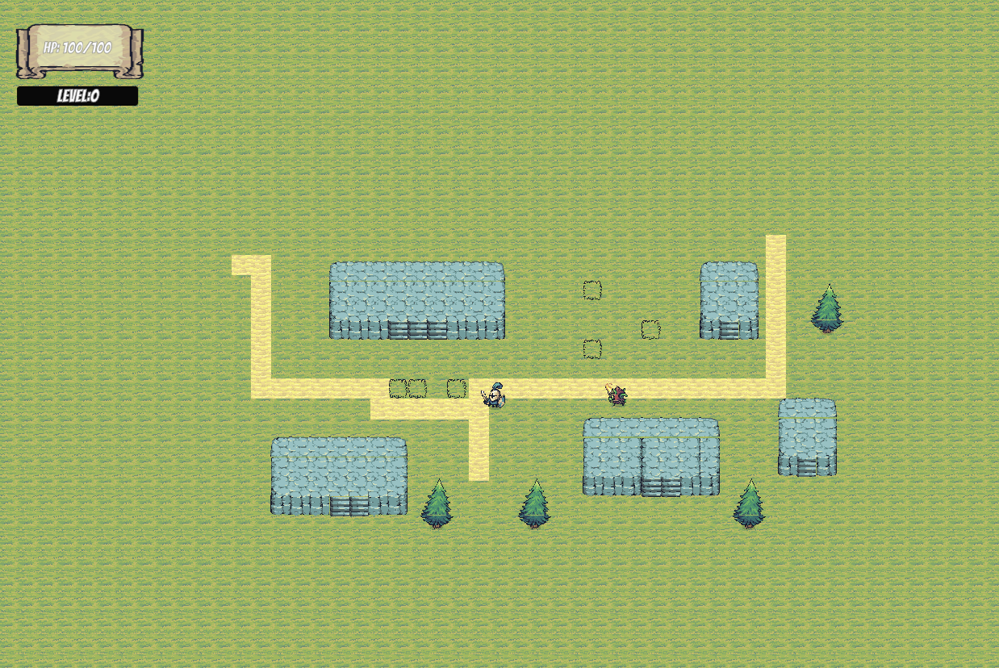
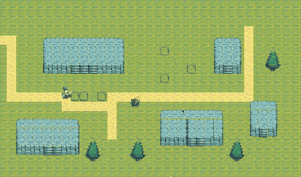
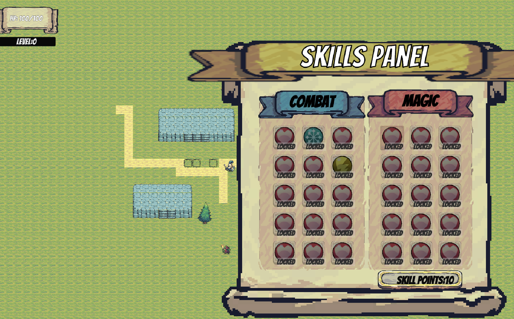
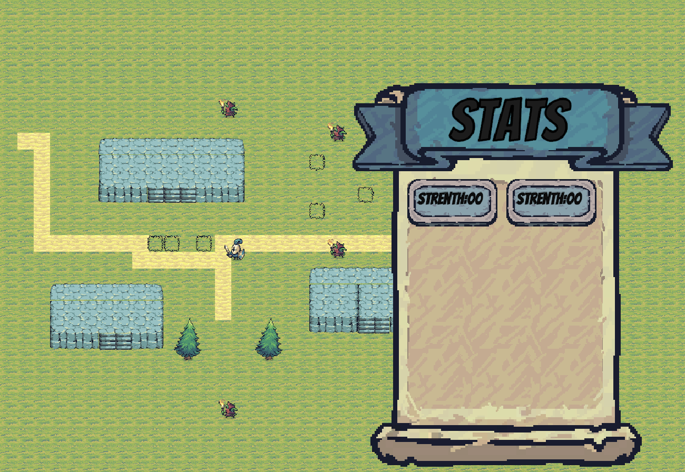
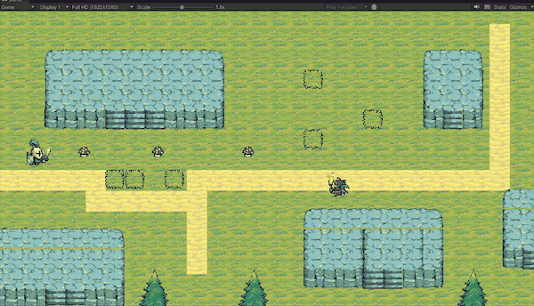
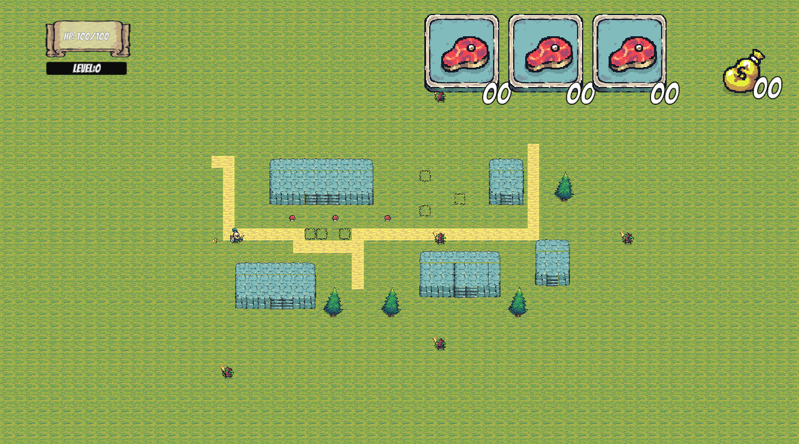

# An 2D RPG Game

### Game Overview
An 2D RPG Game include example of hero animation, tiles map (include animation tiles), cinemachine, enemy chasing, enemy attack (include knock back,remote attack), player UI (health panel,statistics panel and skill panel)

### Knock back

### Skill Panel

### Stats Panel

### Remote attack

### Collect Item

### Inventory Manager

